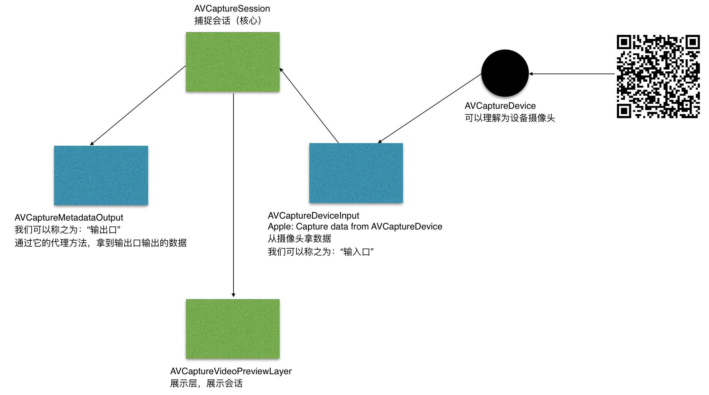
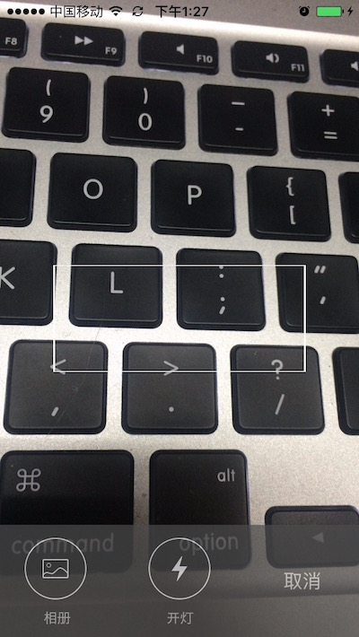
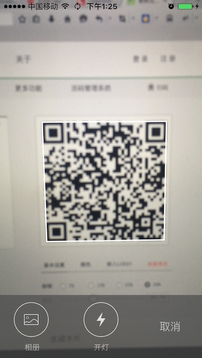

# ZZQRManager
**二维码扫描示意图：**




二维码扫描： iOS7.0 & later  
二维码解码图片：iOS8.0 & later

配置方法：  


使用系统AVFoundation框架进行扫描和解码图片以及二维码的生成。  
二维码扫描(含有解码二维码图片功能)：  

```
ZZQRScanViewController *controller = [[ZZQRScanViewController alloc] init];
[controller setResultHandler:^(ZZQRScanViewController *controller, NSString *result) {
	self.resultLabel.text = result;
	[controller dismissViewControllerAnimated:YES completion:nil];
}];
[self presentViewController:controller animated:YES completion:nil];
```
效果图：  





---------

二维码生成：  
```
- (void)generateQRCode:(id)sender {
    self.resultImageView.image = [ZZQRImageHelper generateImageWithStr:self.inputField.text size:self.resultImageView.frame.size.width];
}
```